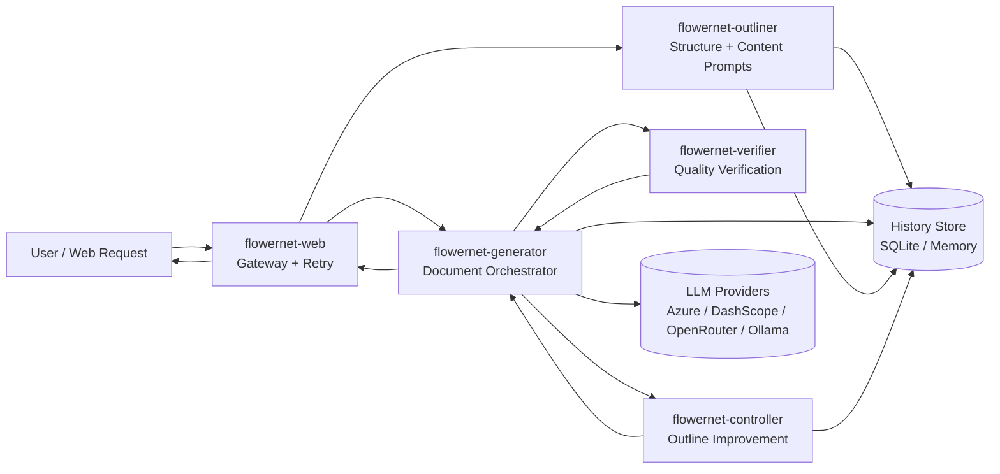
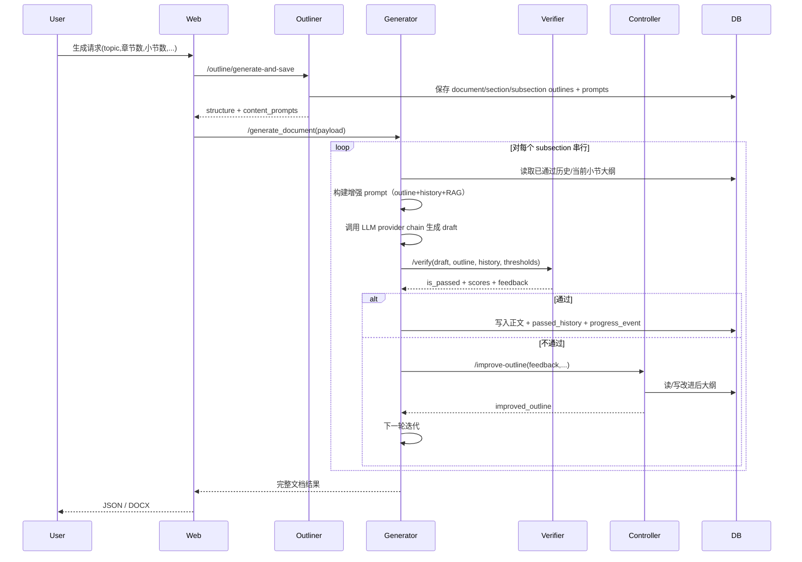

# FlowerNet 架构与算法说明（论文/周报版）

## 1. 系统目标
FlowerNet 是一个“结构化文档生成闭环系统”，目标是：
1. 先规划结构，再按小节逐段生成；
2. 对每段执行自动质量验证（相关性/冗余/来源）；
3. 若不达标，触发改纲并迭代；
4. 保证全流程可追踪、可恢复、可降级。

---

## 2. 总体架构

### 模块职责
- **Outliner**：生成文档标题、章节和小节结构，并为每个小节生成 content prompt。
- **Generator**：按小节顺序生成正文，执行“生成→验证→改纲→再生成”闭环。
- **Verifier**：给出相关性、冗余度、来源引用检查结果。
- **Controller**：根据失败反馈改进大纲（LLM 改纲 + 规则改纲 + 候选打分选优）。
- **Web Gateway**：统一入口，处理下游重试、超时、恢复重跑。
- **History Store**：保存大纲、正文、追踪状态、流程事件。

---

## 3. 端到端时序（单个文档）

---

## 4. 核心算法与策略

## 4.1 Outliner：结构规划算法
1. **两阶段生成**：
   - 阶段A：生成文档结构（title, sections, subsections）；
   - 阶段B：为每个 subsection 生成定制写作提示（content prompt）。
2. **结构约束修复**：如果 LLM 返回数量不符合目标（章节数/小节数），执行裁剪或补齐。
3. **JSON 容错解析**：清洗代码块与噪声后解析，失败时使用更宽松回退解析。
4. **Provider 链式降级**：主提供商失败时切换备援提供商并指数退避。

## 4.2 Generator：闭环编排算法
1. **串行子节生成**：小节按顺序逐个完成，后文读取前文 passed_history。
2. **阈值调度**：
   - 1~5轮：严格阈值；
   - 6~8轮：每轮微放宽 0.01（相关性下调、冗余上调）。
3. **快速失败与兜底**：连续生成失败达到阈值可提前兜底，避免长时间阻塞。
4. **Provider 熔断**：同一提供商连续瞬时失败后进入 cooldown，减少无效重试。
5. **Prompt 预算裁剪**：对 outline/original/rag/history 分别限长，降低超时概率。

## 4.3 Verifier：质量判定算法
### 相关性（Relevancy）
组合评分：
\[
R = 0.4\cdot K + 0.4\cdot RougeL + 0.2\cdot BM25
\]
- \(K\)：关键词覆盖率（大纲实义词在草稿中的覆盖）
- \(RougeL\)：ROUGE-L Recall（草稿对大纲语义覆盖）
- \(BM25\)：基于大纲自比上限归一化的 BM25 相关度

### 冗余度（Redundancy）
对每条历史分别计算并取最大值：
\[
D = \max_i\left(0.5\cdot U_i + 0.3\cdot B_i + 0.2\cdot RougeL_i\right)
\]
- \(U_i\)：与历史第\(i\)条的实义词 unigram 重叠率
- \(B_i\)：与历史第\(i\)条的 bigram 重叠率
- \(RougeL_i\)：与历史第\(i\)条的 ROUGE-L Recall

### 通过判定
\[
pass = (R \ge rel\_threshold) \land (D \le red\_threshold) \land source\_check
\]

## 4.4 Controller：改纲选优算法
1. **双通道候选**：
   - LLM 改纲候选；
   - 规则改纲候选（关键词补强、去重约束、结构化模板）。
2. **候选评分**（示意）：
\[
Score = w_r\cdot AnchorRel + w_n\cdot Novelty + w_s\cdot Structure + 0.05\cdot Delta
\]
- 权重 \(w_r,w_n,w_s\) 会随当前 rel/red 缺口动态调整。
3. **最小增益门槛**：若候选相对 baseline 提升不足，不采用，防止伪改纲。
4. **数据库闭环**：改纲成功后写回 subsection tracking，下一轮生成直接使用最新大纲。

---

## 5. 数据与可观测性
History Store 核心表：
- `outlines`：文档/章节/小节大纲；
- `subsection_tracking`：小节级状态（outline、content、score、iterations）；
- `passed_history`：已通过内容链；
- `progress_events`：可视化流程事件流；
- `history`：兼容层记录。

这使系统具备：
- **可追踪**：每轮发生了什么可回放；
- **可恢复**：中断后可续跑；
- **可分析**：可统计触发率、兜底率、平均迭代数。

---

## 6. 工程韧性机制（当前实现）
1. 下游请求统一重试（指数退避+jitter+Retry-After 支持）；
2. 文档生成串行锁，避免并发写冲突；
3. Provider 冷却与超时可配置，避免“请求风暴”；
4. 失败路径可强制兜底，保证“文档流程尽量完成”；
5. 多提供商降级链，降低单点不可用风险。

---

## 7. 当前已知边界
1. 当主/备 provider 同时不稳定时，系统会转入兜底通过策略（保证流程完成，但内容质量下降）。
2. 引用约束在部分 fallback 模型上可能触发高误拒；系统已支持动态放宽以防死循环。
3. 质量阈值是工程参数，需要按场景（文体、长度、模型）做校准。

---

## 8. 结论（论文式表达）
FlowerNet 采用“结构先行 + 质量闭环 + 改纲迭代 + 数据追踪”的分层架构，通过多算法融合验证（关键词覆盖、ROUGE-L、BM25、n-gram 冗余）与控制层候选改纲选优机制，实现了可执行、可恢复、可观测的文档自动生成流程。系统在上游模型稳定时可生成完整且逻辑一致的文档，在上游波动时通过降级与兜底机制维持流程可用性。
