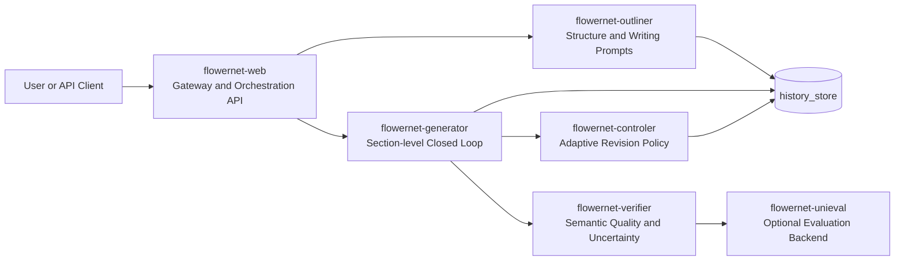
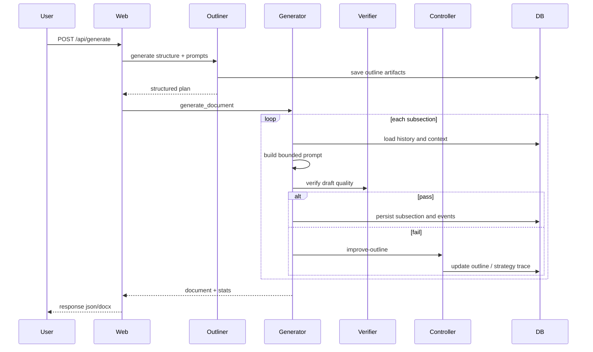

# FlowerNet Agent

FlowerNet Agent is a long-form document generation system with a closed-loop architecture:

- structure-first planning by Outliner
- section-wise generation by Generator
- semantic quality and risk validation by Verifier
- adaptive revision policy by Controller

The core objective is not only "generate text", but to make generation stable, observable, and research-grade under real service constraints.

## Documentation Policy

This repository uses a single-source documentation model:

- All explanatory documentation is maintained in this file only.
- Do not add standalone guide markdown files.
- Operational dependency files such as `requirements.txt` are not documentation and are preserved.

## Why FlowerNet

Compared with a one-shot LLM pipeline, FlowerNet provides:

- quality-gated iterative generation rather than blind direct output
- uncertainty-aware semantic evaluation instead of single scalar heuristics
- constrained non-stationary bandit control instead of static rewrite policy
- offline policy evaluation (IPS/SNIPS/DR) with confidence intervals
- production hardening for timeout/cold-start/restart behaviors

## Architecture



### Service Responsibilities

- `flowernet-web`: unified entry, sync/async generation, stats output, download APIs
- `flowernet-outliner`: generates title/section/subsection plus subsection-level writing prompts
- `flowernet-generator`: runs generation-validation-revision loop per subsection
- `flowernet-verifier`: computes multi-dimensional quality scores, pass/fail decision, uncertainty estimates
- `flowernet-controler`: chooses revision strategy via contextual bandit under constraints
- `flowernet-unieval`: optional dedicated evaluation service used by Verifier
- `history_store.py`: persistence for outlines, subsection states, passed history, progress events

## End-to-End Flow



## Core Methods

### 1) Verifier: Multi-dimensional Semantic Gate

Base relevance and redundancy signals:

$$
R = 0.4K + 0.4RougeL + 0.2BM25
$$

$$
D = \max_i\left(0.5U_i + 0.3B_i + 0.2RougeL_i\right)
$$

Base pass condition:

$$
pass_{base} = (R \ge \tau_{rel}) \land (D \le \tau_{red}) \land source\_check
$$

Extended quality dimensions include:

- `topic_alignment`
- `coverage_completeness`
- `logical_coherence`
- `evidence_grounding`
- `novelty`
- `structure_clarity`

Composite quality gate:

$$
Q = \sum_j w_j s_j, \quad pass = pass_{base} \land (Q \ge \tau_Q)
$$

Uncertainty-aware outputs:

- `quality_dimensions_uncertainty`
- `quality_dimensions_confidence_interval`
- `quality_overall_uncertainty`

### 2) Controller: Constrained Non-Stationary Contextual Bandit

Controller selects an arm from policy candidates, including base and defect-targeted arms.

Examples of arms:

- `llm`
- `rule`
- `rule_structured`
- `defect_topic`
- `defect_evidence`
- `defect_structure`

Context features include verification dimensions, uncertainty, iteration index, subsection position, and failure patterns.

The optimization objective is quality-first with soft constraints:

$$
\max_\pi \; \mathbb{E}[r_t] - \lambda_{lat}(c^{lat}_t - B_{lat}) - \lambda_{tok}(c^{tok}_t - B_{tok})
$$

Dual variables are updated online to enforce latency and token-cost budgets.

To handle non-stationarity, the controller applies drift detection (Page-Hinkley style). Once drift is detected, policy statistics are decayed/reset to recover adaptation speed.

### 3) OPE: Offline Policy Evaluation

Bandit events are logged with propensity for counterfactual evaluation.

- event file: `controller_bandit_events.jsonl`
- evaluator: `bandit_ope.py`
- metrics: `IPS`, `SNIPS`, `DR` with bootstrap confidence intervals

Run:

```bash
python3 bandit_ope.py --events controller_bandit_events.jsonl
```

## Reliability and Production Hardening

The current implementation includes practical safeguards for deployment instability:

- bounded retries and fail-fast fallback to avoid indefinite stalls
- adaptive timeout profile and startup readiness gating
- strict health checks and watchdog auto-restart with cooldown
- provider chain fallback with cooldown and backoff
- prompt budget clipping to prevent context explosion
- partial-progress persistence for long-running generation

## Configuration Essentials

### Quality and Iteration

- `FLOWERNET_REL_THRESHOLD`
- `FLOWERNET_RED_THRESHOLD`
- quality gate related verifier settings

Practical tuning target:

- controller trigger rate around 30% to 50%
- controller effective revision rate at or above 80%

### UniEval Integration

- `UNIEVAL_ENDPOINT`
- `UNIEVAL_TIMEOUT`
- `UNIEVAL_MODEL_NAME`
- `UNIEVAL_MODEL_REVISION`
- `UNIEVAL_CACHE_DIR`
- `UNIEVAL_WAIT_READY`
- `UNIEVAL_READY_TIMEOUT`
- `UNIEVAL_KEEP_ALIVE`
- `UNIEVAL_AUTO_RESTART`
- `UNIEVAL_RESTART_COOLDOWN`

### Bandit and OPE

- constrained optimization knobs (latency/token budgets and dual update params)
- drift detector knobs (threshold/sensitivity/decay)
- OPE logging controls

## Local Run

### Option A: Docker Compose (recommended)

```bash
docker compose up -d --build
```

Default ports:

- verifier: `http://localhost:8000`
- controller: `http://localhost:8001`
- generator: `http://localhost:8002`
- outliner: `http://localhost:8003`
- unieval: `http://localhost:8004`
- web: `http://localhost:8010`

Quick health checks:

```bash
curl -s http://localhost:8010/health
curl -s http://localhost:8002/health
curl -s http://localhost:8000/
```

### Option B: Python Start Script

```bash
python3 start_services.py
```

For full startup logic with readiness/watchdog behavior, use:

```bash
bash start-flowernet-full.sh
```

Stop:

```bash
bash stop-flowernet.sh
```

## API Surface (Common)

Main gateway endpoints:

- `POST /api/generate`
- `POST /api/poffices/generate`
- `POST /api/download-docx`

Useful service endpoints:

- verifier: `POST /verify`
- controller: `POST /improve-outline` (and related strategy endpoints)
- unieval: `POST /score`

## Testing and Validation Scripts

Common scripts in repository root:

- `full_regression_check.py`: local full regression
- `run_remote_full_validation.py`: remote end-to-end validation
- `run_stress_2x2_3x2.py`: stress regression for multi-structure cases
- `diagnose_progress.py`: generation progress diagnostics
- `health-check.sh`: service health collection

## Deployment Notes

- Keep `docker-compose.yml` and `render.yaml` aligned on provider, timeout, retry, and model settings.
- If using SenseNova-only operation, ensure required API keys are set in runtime environment.
- Preserve persistent cache for UniEval to reduce cold-load latency and model drift risk.

## Troubleshooting

### Progress stuck at 0%

Likely causes:

- downstream service cold start or timeout
- verifier unavailable during first generation rounds
- missing progress persistence path due to repeated retries

Actions:

- inspect generator and verifier logs first
- verify readiness endpoints for all services
- increase timeout window only together with retry budget and cooldown

### Frequent controller triggers with low gain

Actions:

- inspect threshold distribution before changing policy
- validate defect arm activation and reward components
- check if drift detector is overly sensitive

### UniEval unstable at startup

Actions:

- verify model cache path and write permission
- pin model revision
- enable wait-ready gate and watchdog cooldown

## Research Positioning (Paper-friendly)

The implemented method can be framed as:

- Contribution A: uncertainty-aware multi-dimensional quality gate for long-form generation
- Contribution B: constrained non-stationary contextual bandit for revision policy learning
- Contribution C: deployable closed-loop generation with reproducible OPE evaluation

Recommended experiment groups:

- static policy baseline vs contextual bandit vs constrained non-stationary bandit
- with/without uncertainty coupling
- with/without defect-specific arms
- with/without UniEval fusion

Recommended metrics:

- quality pass rate
- average iterations to pass
- latency and token cost per accepted subsection
- controller trigger/effectiveness rates
- OPE estimated policy value (IPS/SNIPS/DR + CI)

## Repository Documentation Scope

This `README.md` now consolidates all previous explanatory `.md` and summary `.txt` docs in the repository.

## Performance Optimization (v2.0)

### Baseline and Current Status

**Baseline (pre-optimization):** 2x2 documents (2 sections × 2 subsections) generated in ~995.60 seconds

**Current optimized configuration** (applied 2026-04-20):
- Status: ✅ Optimization applied, testing in progress
- Expected improvement: **>15%** (target: <846 seconds)

### Applied Optimizations

#### 1) **Token Budget Reduction**
- **Generator max_tokens**: 600 → 320 (-47%)
  - Reduces output length while preserving content richness
  - 320 tokens ≈ 800-1000 Chinese characters
  
- **Outliner detailed outline tokens**: 2200 → 1600 (-27%)
  - Maintains structural clarity while reducing generation time

**Impact:** ~30-40% latency reduction for LLM generation phase

#### 2) **Context Window Optimization**
- **History window size**: 3 → 2 subsections
  - Uses only the most recent 2 subsections as context
  - Reduces input token count without losin
## Performance Optimization (v2.0)

### Baseline and Current Status

**BaselineK m
### Baseline and Current Status
- *
**Baseline (pre-optimization) ?**Current optimized configuration** (applied 2026-04-20):
- Status: ✅ Optimization applied, tequest proc- Status: ✅ Optimization applied, testing in progress
ie- Expected improvement: **>15%** (target: <846 secondsix
### Applied Optimizations

#### 1) **Token Budget Red→
#### 1) **Token Budget s p- **Generator max_tokens**: 600 ?e  - Reduces output length while preserving co P  - 320 tokens ≈ 800-1000 Chinese characters
  
- **Outl--  
- **---------|----------|
| `max_tokens` (ge-er  - Maintains structural clarity while reducing generation | 
**Impact:** ~30-40% latency reduction for LLM generation phas`PR
#### 2) **Context Window Optimization**
- **History window simp- **History window size**: 3 → 2 subS`  - Uses only the most recent 2 subsections apy  - Reduces input token count without losin
## Perforor## Performance Optimization (v2.0)

### Ba_T
### Baseline and Current Status
| `
**BaselineK m
### Baseline an 12### Baseline5`- *
**Baseline (pre-optimizatl o**im- Status: ✅ Optimization applied, tequest proc- Status: ✅ Optimization applied, testindie- Expected improvement: **>15%** (target: <846 secondsix
### Applied Optimizations

#### 1) **Token se### Applied Optimizations

#### 1) **Token Budget Red→
me
#### 1) **Token Budget  pa#### 1) **Token Budget s p- o-  
- **Outl--  
- **---------|----------|
| `max_tokens` (ge-er  - Maintains structural clarity while reducing generation | 
**Impact:** ~30-40% latency st-ad- **-------es| `max_tokens`save 2-5% la**Impact:** ~30-40% latency reduction for LLM generation phas`PR
#### 2) **ContexEM#### 2) **Context Window Optimizatiolity by 2-5%

3. **Enable RAG- **History window simp- **History winar## Perforor## Performance Optimization (v2.0)

### Ba_T
### Baseline and Current Status
| `
**BaselineK m
### Baseline an 12### Baseline5`- *
**Baselinein
### Ba_T
### Baseline and Current Status
| ble### Basy)| `
**BaselineK m
### Baselinet-**en### Baseline "**Baseline (pre-optimizatl o**im- 
 ### Applied Optimizations

#### 1) **Token se### Applied Optimizations

#### 1) **Token Budget Red→
me
#### 1) **Token Budget  pa#### 1) **Token Budget s p- o-  
- **Outl--  
- *  
#### 1) **Token se### A   
#### 1) **Token Budget Red→
me
#### 1) me(me
#### 1) **Token Budget  p:/#lo- **Outl--  
- **---------|----------|
| `max_tokens` (gela- **-------.t| `max_tokens` (ge-er  -p.**Impact:** ~30-40% latency st-ad- **-------es| `max_tokens`save 2-5% la**Impact:* #### 2) **ContexEM#### 2) **Context Window Optimizatiolity by 2-5%

3. **Enable RAG- **History window simp- **History winar## Perforor#se
3. **Enable RAG- **History window simp- **History winar## Perfor Se
### Ba_T
### Baseline and Current Status
| `
**BaselineK m
### Baseline an 12### Baselineon.

