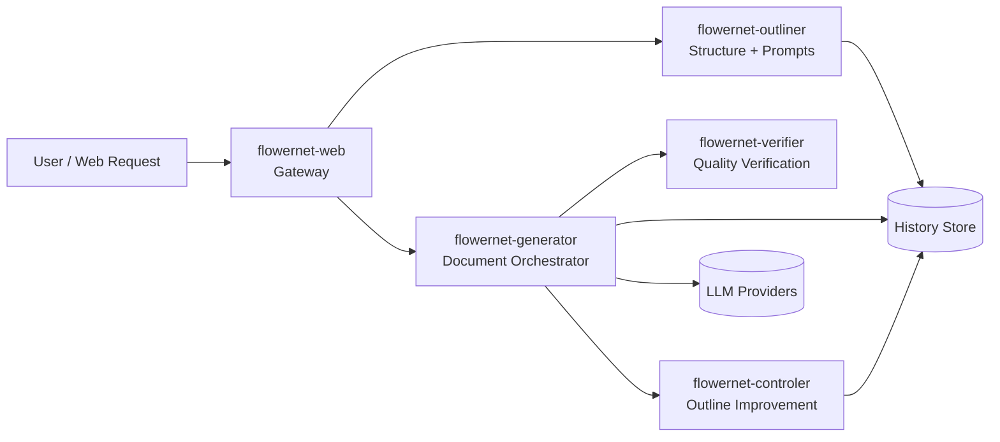
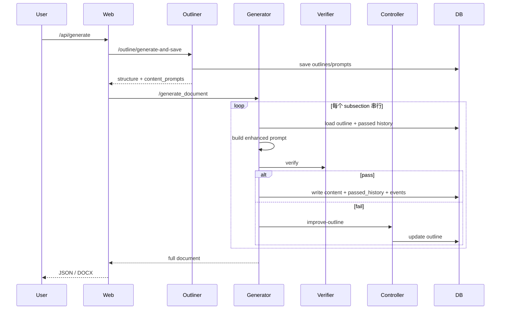

# FlowerNet

FlowerNet 是一个面向长文档生成的多服务系统，采用“结构先行 + 质量闭环 + 改纲迭代 + 可观测追踪”的流程：
- 先由 Outliner 生成文档结构与小节写作提示
- 再由 Generator 按小节串行生成草稿
- 每轮交给 Verifier 做相关性/冗余度/来源检查
- 不通过时由 Controller 改进大纲并继续迭代

---

## 文档维护规则（重要）

- 本仓库的说明文档统一维护在本 README 中。
- 不再新增独立 `.md` 说明文档（除本文件外）。
- 需要补充说明时，请直接更新 `README.md`。

---

## 系统架构



### 模块职责
- `flowernet-web`：统一入口，调用 Outliner + Generator，提供同步/异步文档生成与下载接口。
- `flowernet-outliner`：生成文档结构与每个 subsection 的 content prompt。
- `flowernet-generator`：执行小节级闭环（生成→验证→改纲→重试/兜底）。
- `flowernet-verifier`：计算相关性、冗余度，并执行来源引用校验。
- `flowernet-controler`：对未通过小节进行改纲优化（LLM + 规则策略）。
- `history_store.py`：保存 outlines、subsection_tracking、passed_history、progress_events。

---

## 端到端时序



---

## 核心算法与策略

### 1) Outliner
- 两阶段生成：结构（title/section/subsection）+ content prompts。
- JSON 容错：清洗与修复模型返回，尽量避免解析失败。
- provider chain：主 provider 失败时自动降级。

### 2) Generator Orchestrator
- 小节串行：上一小节通过后再处理下一小节。
- 阈值调度：第 1~5 轮严格阈值；第 6~8 轮每轮放宽 0.01。
- 快速失败兜底：单小节连续生成失败达到阈值后直接兜底通过，避免卡死。
- Controller 兜底：Controller 连续失败后启用本地规则改纲。
- Prompt 预算裁剪：分别限制 outline/original/rag/history 长度。

### 3) Verifier
- 相关性（Relevancy）组合评分：

$$
R = 0.4\cdot K + 0.4\cdot RougeL + 0.2\cdot BM25
$$

- 冗余度（Redundancy）按历史最大值：

$$
D = \max_i\left(0.5\cdot U_i + 0.3\cdot B_i + 0.2\cdot RougeL_i\right)
$$

- 判定：

$$
pass = (R \ge rel\_threshold) \land (D \le red\_threshold) \land source\_check
$$

### 4) Controller
- 双通道候选：LLM 改纲 + 规则改纲。
- 候选打分（示意）：

$$
Score = w_r\cdot AnchorRel + w_n\cdot Novelty + w_s\cdot Structure + 0.05\cdot Delta
$$

- 动态权重与最小收益门槛，避免无效改纲循环。

---

## 当前默认阈值与建议

代码默认（见 `flowernet-generator/flowernet_orchestrator_impl.py`）：
- `rel_threshold = 0.75`
- `red_threshold = 0.50`

触发率调优建议：
- 触发率偏低（<30%）：上调 `rel_threshold` 或下调 `red_threshold`
- 触发率偏高（>50%）：下调 `rel_threshold` 或上调 `red_threshold`

建议目标：
- Controller 触发率 30%~50%
- Controller 改纲有效率 >= 80%

---

## Provider 与容错

当前工程支持：
- Azure OpenAI
- DashScope（OpenAI-compatible）
- OpenRouter
- Ollama

关键容错机制：
- provider chain 自动降级
- provider 冷却（failure threshold + cooldown）
- HTTP timeout 可配置
- 指数退避 + jitter
- 文档级串行锁，避免并发冲突

---

## 本地运行

### 方式一：Docker Compose（推荐）

```bash
docker compose up -d --build
```

核心端口：
- Verifier: `http://localhost:8000`
- Controller: `http://localhost:8001`
- Generator: `http://localhost:8002`
- Outliner: `http://localhost:8003`
- Web: `http://localhost:8010`

快速检查：

```bash
curl -s http://localhost:8010/health
curl -s http://localhost:8002/health
```

### 方式二：Python 直接启动

```bash
python3 start_services.py
```

---

## Web API（常用）

- `POST /api/generate`：同步生成文档
- `POST /api/poffices/generate`：Poffices 集成入口
- `POST /api/download-docx`：下载 DOCX

环境变量（`flowernet-web`）：
- `OUTLINER_URL`（默认 `http://localhost:8003`）
- `GENERATOR_URL`（默认 `http://localhost:8002`）
- `REQUEST_TIMEOUT`（默认 `3600`）
- `API_AUTH_ENABLED` / `FLOWERNET_API_KEY` / `FLOWERNET_BEARER_TOKEN`

---

## 关键配置清单（部署前必查）

- 本地 `docker-compose.yml` 与云端 `render.yaml` 的 provider/timeout/retry 参数保持一致。
- 确认所有服务使用一致的关键模型配置（如 `DASHSCOPE_MODEL`、Azure deployment）。
- 若启用远程历史，确认 `USE_REMOTE_HISTORY=true` 且 `OUTLINER_URL` 可访问。
- 若使用 Ollama fallback，确认模型已拉取并可用。

---

## 故障排查

### 1) Generator 超时或卡住
- 检查 provider timeout、重试参数、prompt budget 是否过大。
- 检查 provider 是否进入 cooldown（连续失败后短时禁用）。

### 2) Controller 频繁触发且收益低
- 先观察 rel/red 分布，再微调阈值。
- 检查是否出现 outline 污染（当前已采用“标记块替换”避免叠加污染）。

### 3) 引用校验导致循环
- fallback provider（尤其本地模型）引用能力弱时，可动态放宽 source citation 硬约束。

---

## 目录清理说明

为减少干扰，本仓库已清理临时调试脚本与独立说明文档；后续新增说明请直接补充到本 `README.md`。
